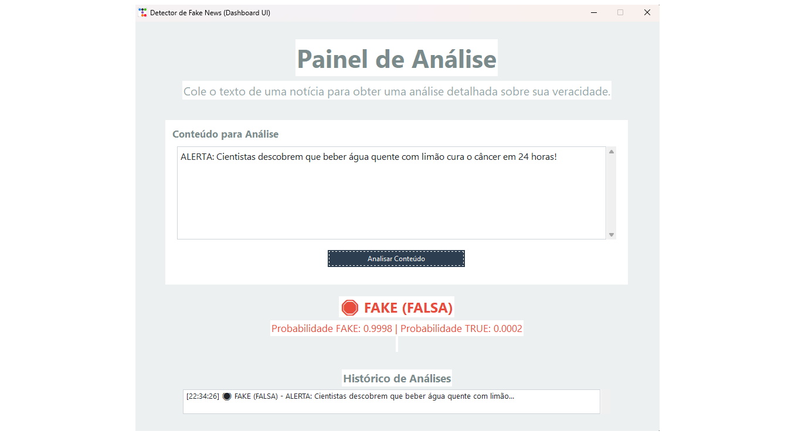

# Detector de Fake News com LSTM

Este projeto implementa um sistema completo para detecção de fake news em notícias de texto, utilizando um modelo LSTM (PyTorch) e uma interface gráfica moderna baseada em ttkbootstrap.

## Descrição do Problema
Fake news têm grande impacto social, político e econômico, podendo influenciar eleições, causar pânico e desinformação. Este projeto visa automatizar a detecção de notícias falsas usando técnicas modernas de Processamento de Linguagem Natural (NLP) e deep learning, facilitando a análise rápida e confiável de notícias.

## Funcionalidades
- Treinamento de modelo LSTM para classificação binária (Fake/Verdadeira)
- Pré-processamento e tokenização de textos
- Codificação de rótulos (LabelEncoder)
- Interface gráfica intuitiva e moderna para análise de notícias
- Predição via terminal ou interface
- Organização do projeto em pastas (`src`, `models`, `data`)

## Detalhes Técnicos do Modelo
- **Arquitetura:** LSTM bidirecional com PyTorch
- **Camadas:**
  - Embedding (dim=100)
  - LSTM (hidden_dim=128, num_layers=2, bidirectional=True, dropout=0.3)
  - Linear (hidden_dim*2 → 1)
  - Ativação final: Sigmoid
- **Tokenização:** palavra a palavra, sem remoção de stopwords
- **Tamanho do vocabulário:** 10.000 palavras mais frequentes
- **Batch size:** 64
- **Épocas:** 10 (padrão)
- **Limiar de decisão:** 0.5

## Sobre o Dataset
- **Arquivo:** `data/dados_limpos.csv`
- **Colunas principais:** `text` (notícia), `label` (0=fake, 1=verdadeira)
- **Quantidade de exemplos:** ~45.000
- **Proporção:** aproximadamente balanceado entre fake e true
- **Idioma:** inglês
- **Origem:** coletado e limpo a partir de bases públicas de notícias
- **Fonte:** [Fake and Real News Dataset - Kaggle](https://www.kaggle.com/datasets/clmentbisaillon/fake-and-real-news-dataset/data)

## Como funciona
1. **Pré-processamento:**
   - Os textos das notícias são convertidos em sequências numéricas usando um tokenizador simples.
   - As classes (fake/verdadeira) são codificadas como 0 (fake) e 1 (verdadeira).
2. **Treinamento:**
   - O modelo LSTM é treinado com PyTorch usando os textos tokenizados e os rótulos codificados.
   - O modelo aprende a distinguir padrões entre notícias falsas e verdadeiras.
   - Os arquivos do modelo (`best_lstm_model.pth`), tokenizer (`lstm_tokenizer.pkl`) e label encoder (`label_encoder.pkl`) são salvos na pasta `models`.
3. **Predição:**
   - O texto de uma notícia é tokenizado e passado para o modelo LSTM.
   - O modelo retorna a probabilidade de ser verdadeira (classe 1).
   - Se a probabilidade for maior que 0.5, a notícia é classificada como verdadeira; caso contrário, como fake.
   - As probabilidades de cada classe são exibidas de forma clara na interface.

## Como usar

### 1. Instale as dependências
Certifique-se de ter Python 3.8+ e instale os pacotes necessários:
```bash
pip install torch pandas scikit-learn ttkbootstrap
```

### 2. Treine o modelo (opcional)
Se quiser treinar do zero:
```bash
python src/train_lstm_model_pytorch.py
```
Isso irá gerar os arquivos do modelo e dos encoders em `models/`.

### 3. Gere o tokenizer e label encoder (se necessário)
```bash
python src/save_tokenizer_labelencoder.py
```

### 4. Execute a interface gráfica
```bash
python src/interface_gui_bootstrap.py
```
Cole ou digite o texto da notícia, clique em "Analisar Conteúdo" e veja o resultado.

### 5. Predição via terminal (opcional)
```bash
python src/predict_lstm.py
```
Digite o texto quando solicitado.

## Exemplo de Uso

**Terminal:**
```bash
python src/predict_lstm.py
Digite o texto da notícia para prever:
"ALERTA: Cientistas descobrem que beber água quente com limão cura o câncer em 24 horas!"
Resultado: FAKE (FALSA)
Probabilidade de ser FAKE: 0.98
Probabilidade de ser TRUE: 0.02
```

**Interface Gráfica:**
1. Cole ou digite o texto da notícia
2. Clique em "Analisar Conteúdo"
3. Veja o resultado colorido e as probabilidades

## Visual da Interface




## Como treinar com novos dados
1. Substitua o arquivo `data/dados_limpos.csv` pelo novo dataset (mesmo formato: colunas `text` e `label`)
2. Execute:
   ```bash
   python src/train_lstm_model_pytorch.py
   python src/save_tokenizer_labelencoder.py
   ```
3. Use normalmente a interface ou o terminal para predições

## Possíveis Expansões
- Adicionar explicabilidade (ex: LIME, SHAP)
- Suporte a outros idiomas
- Treinamento com outros modelos (BERT, ensemble)
- Deploy web (Streamlit, Gradio)
- Adicionar análise de sentimento ou credibilidade
- Melhorar o pré-processamento (remoção de stopwords, lematização)

## Estrutura das pastas
```
├── data/
│   └── dados_limpos.csv
├── models/
│   ├── best_lstm_model.pth
│   ├── lstm_tokenizer.pkl
│   └── label_encoder.pkl
├── src/
│   ├── interface_gui_bootstrap.py
│   ├── predict_lstm.py
│   ├── save_tokenizer_labelencoder.py
│   ├── train_lstm_model_pytorch.py
│   └── load_lstm_model.py
└── README.md
```

## Licença
Este projeto é livre para fins acadêmicos e de demonstração. Sinta-se à vontade para adaptar e expandir conforme sua necessidade.

## Autor
Liriel Castro
Projeto desenvolvido para fins de estudo e demonstração. 