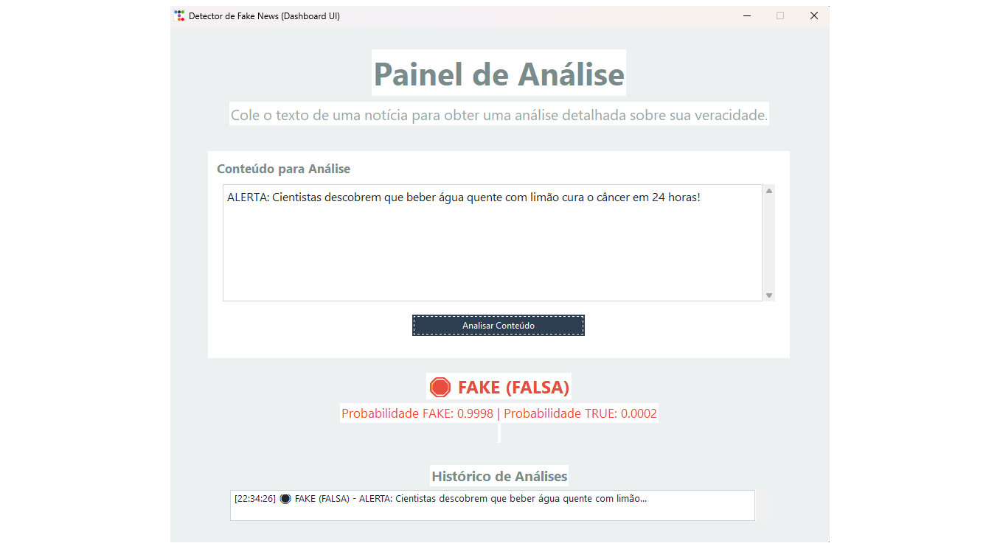

# Fake News Detector — Bidirectional LSTM (PyTorch)

A complete pipeline for detecting fake news in English-language articles, combining a bidirectional LSTM classifier built with PyTorch and a desktop GUI powered by ttkbootstrap.

---

## Table of Contents
1. [Motivation](#motivation)
2. [Project Overview](#project-overview)
3. [Model Architecture](#model-architecture)
4. [Training Details](#training-details)
5. [Dataset](#dataset)
6. [How It Works](#how-it-works)
7. [Repository Structure](#repository-structure)
8. [Installation](#installation)
9. [Usage](#usage)
10. [GUI Preview](#gui-preview)
11. [Training on New Data](#training-on-new-data)
12. [Future Work](#future-work)
13. [License](#license)
14. [Author](#author)

---

## Motivation

Misinformation has measurable social, political, and economic consequences — from influencing elections to triggering public panic. Automating the detection of fake news via Natural Language Processing (NLP) and deep learning enables faster, scalable analysis that can complement human fact-checking.

This project explores a recurrent neural network approach (BiLSTM) that captures sequential and contextual patterns in text, which are often informative signals for distinguishing fabricated from genuine news.

---

## Project Overview

| Component | Technology |
|---|---|
| Deep learning framework | PyTorch |
| Model type | Bidirectional LSTM |
| Text tokenization | Custom word-level tokenizer |
| Label encoding | scikit-learn `LabelEncoder` |
| GUI | ttkbootstrap (Tkinter-based) |
| Dataset | ~45 000 labeled English news articles |

The system supports three modes of interaction:
- **Training** — build the model from scratch using the provided dataset.
- **Terminal prediction** — classify a single article via the command line.
- **GUI dashboard** — an interactive desktop interface for real-time analysis.

---

## Model Architecture

The classifier is a **bidirectional LSTM** with the following layers:

```
Input (token IDs, max_len=200)
  │
  ▼
Embedding          vocab_size × 100
  │
  ▼
BiLSTM             hidden_dim=128, num_layers=2, dropout=0.3
  │                (output dim = 128 × 2 = 256, bidirectional)
  ▼
Dropout (0.3)
  │
  ▼
Linear             256 → 1
  │
  ▼
Sigmoid            → probability ∈ (0, 1)
```

The bidirectional design lets the model attend to both past and future context within each sequence, which improves accuracy on longer, information-dense articles.

Only the **last hidden state** of the LSTM (position `[:, -1, :]`) is passed to the linear head, acting as a fixed-length document representation.

---

## Training Details

| Hyperparameter | Value |
|---|---|
| Vocabulary size | 10 000 most frequent words |
| Max sequence length | 200 tokens |
| Embedding dimension | 100 |
| LSTM hidden dimension | 128 (×2 bidirectional) |
| LSTM layers | 2 |
| Dropout | 0.3 |
| Batch size | 64 |
| Optimizer | Adam (lr=0.001) |
| Loss function | Binary Cross-Entropy (`BCELoss`) |
| LR scheduler | `ReduceLROnPlateau` (patience=3, factor=0.5) |
| Early stopping patience | 5 epochs |
| Default max epochs | 10 |
| Decision threshold | 0.5 |
| Train / validation split | 80 / 20 |

The best checkpoint (lowest validation loss) is saved automatically to `models/best_lstm_model.pth` during training.

---

## Dataset

| Property | Detail |
|---|---|
| File | `data/dados_limpos.csv` |
| Columns | `text` (article body), `label` (`0` = fake, `1` = real) |
| Size | ~45 000 examples |
| Class balance | Approximately balanced |
| Language | English |
| Source | [Fake and Real News Dataset — Kaggle](https://www.kaggle.com/datasets/clmentbisaillon/fake-and-real-news-dataset/data) |

The CSV was pre-cleaned from the original Kaggle source (null rows removed, labels normalized). No stopword removal or stemming is applied at this stage; the model learns directly from raw lowercased token sequences.

---

## How It Works

### 1. Tokenization

A custom `SimpleTokenizer` builds a vocabulary from the training corpus by frequency ranking. Each word is mapped to an integer index; out-of-vocabulary words are mapped to `<OOV>` (index 1) and padding uses `<PAD>` (index 0). Sequences are truncated or padded to `max_len=200`.

```
"Breaking news: scientists discover ..." → [145, 22, 876, 3401, ...]  (length 200)
```

### 2. Training Loop

Each epoch runs a standard supervised pass:
- Forward pass through Embedding → BiLSTM → Dropout → Linear → Sigmoid.
- Loss computed with `BCELoss`.
- Gradients clipped implicitly by Adam's adaptive learning rate.
- Validation loss monitored for early stopping and checkpoint saving.

### 3. Inference

Given a raw article string:
1. Tokenize and encode to a fixed-length integer tensor.
2. Pass through the frozen model (`model.eval()`, `torch.no_grad()`).
3. The sigmoid output is interpreted as `P(real)`.
4. If `P(real) > 0.5` → classified as **REAL**; otherwise → **FAKE**.
5. Both class probabilities are displayed to the user.

---

## Repository Structure

```
FakeNewsDetector/
├── data/
│   └── dados_limpos.csv           # Pre-cleaned labeled dataset
├── models/
│   ├── best_lstm_model.pth        # Best model weights (saved during training)
│   ├── lstm_tokenizer.pkl         # Fitted SimpleTokenizer instance
│   └── label_encoder.pkl          # Fitted LabelEncoder instance
├── src/
│   ├── train_lstm_model_pytorch.py  # Full training pipeline
│   ├── save_tokenizer_labelencoder.py  # Re-save tokenizer/encoder separately
│   ├── predict_lstm.py            # CLI inference script
│   ├── load_lstm_model.py         # Model loading utilities
│   └── interface_gui_bootstrap.py # ttkbootstrap desktop GUI
├── print.png                      # GUI screenshot
└── README.md
```

---

## Installation

**Requirements:** Python 3.8+

```bash
pip install torch pandas scikit-learn ttkbootstrap
```

> For GPU-accelerated training, install the CUDA-enabled PyTorch build from [pytorch.org](https://pytorch.org/get-started/locally/). The code automatically uses `cuda` if available, falling back to `cpu`.

---

## Usage

### Train the model

Runs the full pipeline: loads data, fits the tokenizer, trains the BiLSTM, and saves weights + artifacts to `models/`.

```bash
python src/train_lstm_model_pytorch.py
```

### Save tokenizer and label encoder separately (if needed)

```bash
python src/save_tokenizer_labelencoder.py
```

### Classify a news article via the terminal

```bash
python src/predict_lstm.py
```

Example session:

```
Enter the news text to classify:
> Scientists claim that drinking hot lemon water cures cancer in 24 hours!

Result  : 🛑 FAKE
P(fake) : 0.9812
P(real) : 0.0188
```

### Launch the desktop GUI

```bash
python src/interface_gui_bootstrap.py
```

1. Paste or type the article text into the input area.
2. Click **Analyze Content**.
3. The result (FAKE / REAL) and both class probabilities are displayed instantly.
4. A timestamped history of previous analyses is maintained in the lower panel during the session.

---

## GUI Preview



---

## Training on New Data

1. Replace `data/dados_limpos.csv` with your dataset. The file must contain at least two columns: `text` (article body as a string) and `label` (`0` for fake, `1` for real).
2. Re-run training and artifact generation:
   ```bash
   python src/train_lstm_model_pytorch.py
   python src/save_tokenizer_labelencoder.py
   ```
3. Use the GUI or CLI as normal — new model weights and tokenizer are picked up automatically.

---

## Future Work

- **Explainability** — integrate LIME or SHAP to highlight which words drove the prediction.
- **Stronger baselines** — fine-tune a pre-trained transformer (e.g., BERT, RoBERTa) for comparison.
- **Ensemble methods** — combine BiLSTM outputs with TF-IDF + gradient boosting.
- **Multilingual support** — extend to Portuguese and other languages via multilingual embeddings.
- **Web deployment** — expose the model via a Streamlit or Gradio app.
- **Richer preprocessing** — experiment with stopword removal, lemmatization, and sub-word tokenization.
- **Metadata features** — incorporate headline, source domain, and publication date as auxiliary signals.

---

## License

This project is free for academic and demonstration purposes. Feel free to adapt and extend it for your own research or coursework.

---

## Author

**Liriel Castro** — developed as a study and demonstration project.
